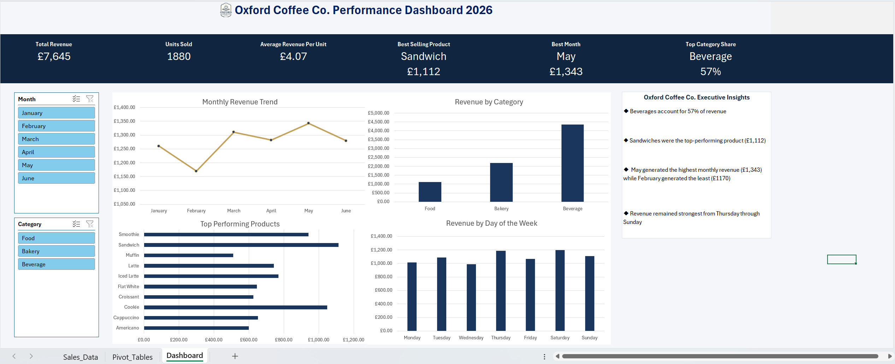
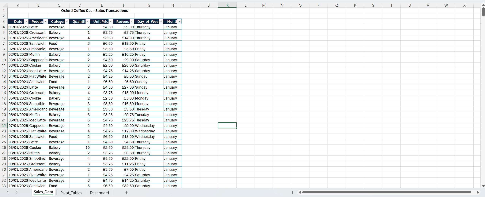
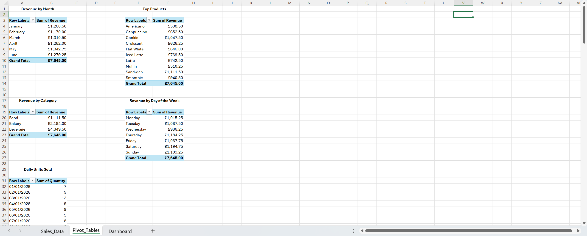

# Coffee Shop Oxford Co. Dashboard

## Overview
An interactive Excel dashboard designed to analyse coffee shop sales performance through interactive charts and clear KPI reports. The dashboard is built to help users easily interpret business performance by identifying trends, filtering data and tracking key metrics.

## Features
- Instant calculation of key business KPIs.
- Interactive charts that update dynamically with slicer filtering.
- Slicers for filtering sales data by different categories.
- Executive insights based on the overall data, highlighting key trends and business performance.
- Clean data table that can be referenced or expanded.

## Background
Businesses frequently collect large volumes of sales data but struggle to display it  in a way easy to interpret and make key, strategic decisions based on the trends seen. This dashboard tackles that issue converting the raw sales data into an interactive Excel dashboard that presents KPIs, trends and business insights in an accessible format for both technical and non-technical users.

## Technologies Used
- Microsoft Excel
- Pivot Tables 
- Pivot Charts
- Slicers

## Requirements
- Microsoft Excel (Desktop Version)

## How to Use:

1. Open the workbook in Microsoft Excel.
2. Navigate to the Dashboard worksheet.
3. Use the slicers to filter the data by the available categories.
4. The KPIs, charts and insights update automatically based on the selected filters.

## Dashboard Contents:

- Interactive Dashboard
- KPI Cards
- Pivot Tables
- Pivot Charts
- Raw Sales Data Table
- Supporting Pivot Tables Sheet

## Screenshots

### Dashboard

### Sales Data

### Pivot Tables

